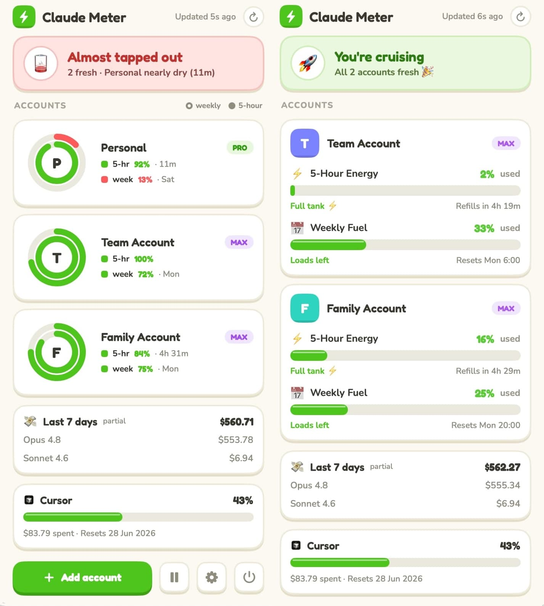
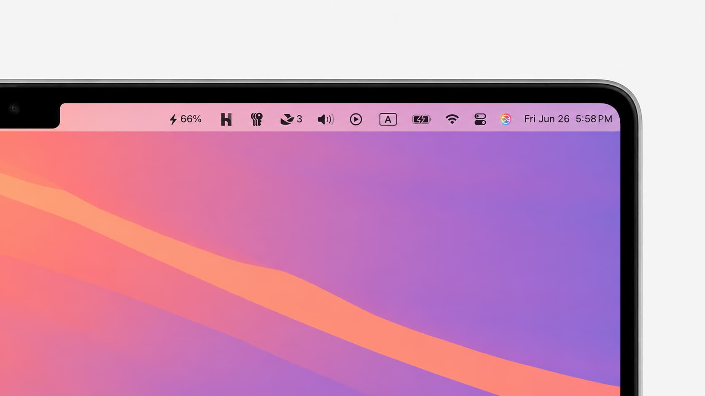
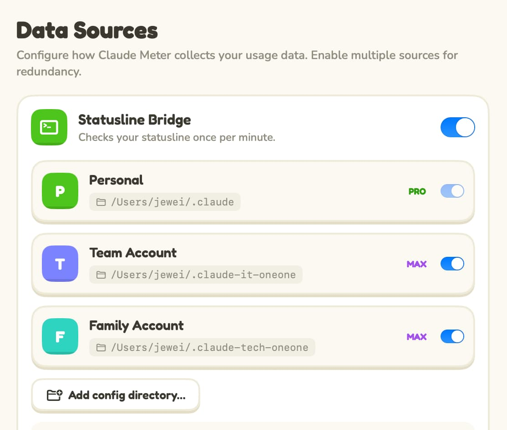
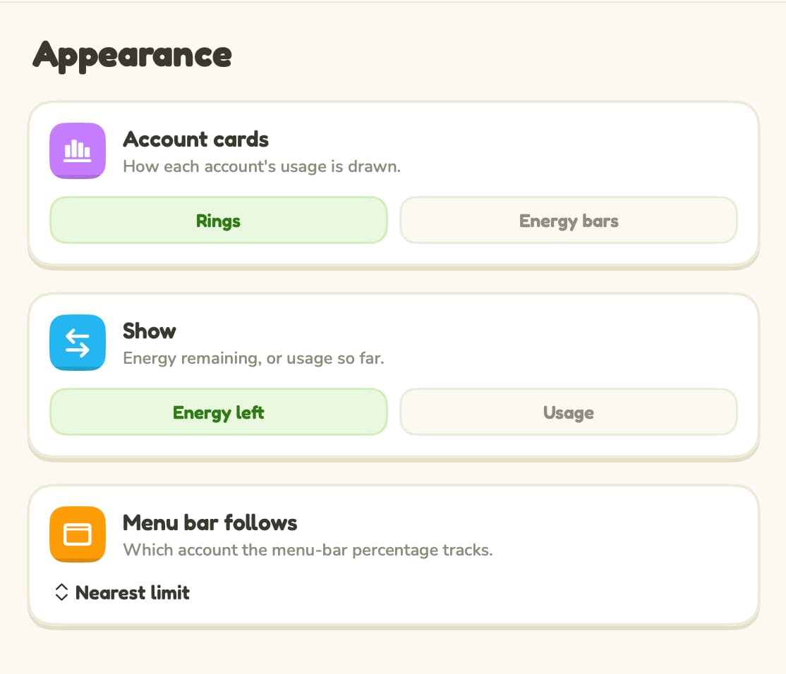

When we introduced **Claude Meter**, it had one job: never let a _rate limit_ blindside you again. It put your Claude usage up in the menu bar so you could stay in flow instead of digging through dashboards. That job hasn't changed.

But the popover behind that little percentage? It was a tidy spreadsheet — gray bars, gray numbers, very Correct, very forgettable. So for 2.0 we rebuilt the whole thing around a single reframe: you're not watching a quota drain. You've got **energy**, and you're spending it. ⚡

## New here? The 30-second version

Claude Meter is a free, open-source macOS menu bar app that shows how much of your Claude usage you have left — your 5-hour session window and your weekly limits — right next to the clock. It reads the same data Claude Code already writes to your Mac, so there's nothing to configure and nothing leaves your laptop. (The original story lives over in [Introducing Claude Meter](https://jewei.net/introducing-claude-meter/).)

Everything below is what's new in 2.0.

## Your usage is energy now

Open the popover and you get a one-line read on how you're doing — _"You're cruising,"_ _"Pace yourself,"_ _"Almost tapped out"_ — and then a card for each account.

The real shift is the framing. Instead of "84% used" creeping toward a wall, Claude Meter now shows the **energy you have left**, and the rings (or bars) _deplete_ as you work. Green when you're flush, amber when you should ease off, red when you're nearly dry. Same numbers underneath — friendlier mental model. A glance tells you whether to keep shipping or go _touch grass_ for a bit while the window refills.

Prefer the classic "% used, filling up" view? It's a one-tap setting — more on that in a moment.

## A card for every account

If you run more than one Claude account — a personal one, a work one, a team seat — you already know the annoying part: rate limits are **per account**, and most tools mash them into one meaningless average. Claude Meter never has, and in 2.0 each account gets its own energy card: its own rings, its 5-hour and weekly windows, its own reset countdowns.

You can make them _yours_, too:

- **Name them.** "Default" becomes "Personal," "claude-work" becomes "Work."
- **Tag the plan.** A little **Pro** / **Max** / **Team** badge per account, so you always know which seat you're looking at.

## Make it yours

Not everyone reads usage the same way, so 2.0 adds an **Appearance** tab with three switches:

- **Rings or bars.** Circular activity rings, or chunky horizontal energy bars — whichever you read faster.
- **Energy left or usage.** Keep the playful "energy remaining" view, or flip every ring, bar, and number back to classic "% used."
- **Menu bar follows.** By default the menu bar shows whichever account is _nearest_ its limit. Pin it to one specific account instead, and that's the number you'll always see.

## Still quietly looking out for you

The new coat of paint didn't cost the substance:

- **Notifications that speak human.** A nudge when a window runs low (_"Running low ⚡ — maybe touch grass? 🌱"_), and a little celebration when it refills (_"You're refueled! 🎉"_).
- **A desktop widget**, redesigned to match — depleting energy rings, light and dark.
- **Zero-config, still.** It rides Claude Code's status line; install it and it just works.
- **Private by design.** Your usage is read from files already on your Mac — no middleman server, no account, no telemetry.

(And if you live in Cursor too, it gets its own card — opt-in.)

## Designed with Claude, for Claude users

One aside we can't resist: 2.0's look started as a design in Claude's design tool and was built, almost end to end, with Claude Code. An app for Claude users, polished by Claude itself. It felt right.

## Free, open source, and a click away

Claude Meter 2.0 is **free and open source**, signed and notarized — and if you're already running it, it'll update itself.

- ⬇️ **[Download Claude Meter 2.0](https://github.com/jewei/claude-meter/releases/latest)** (macOS 14+)
- ⭐ **[Star it on GitHub](https://github.com/jewei/claude-meter)** — issues and PRs welcome.

If it saves you from one more _rate limit_ ambush, that's the whole point. And if you'd like to keep it caffeinated, [sponsoring the project](https://github.com/sponsors/jewei) is the kindest way to say thanks. ⚡
