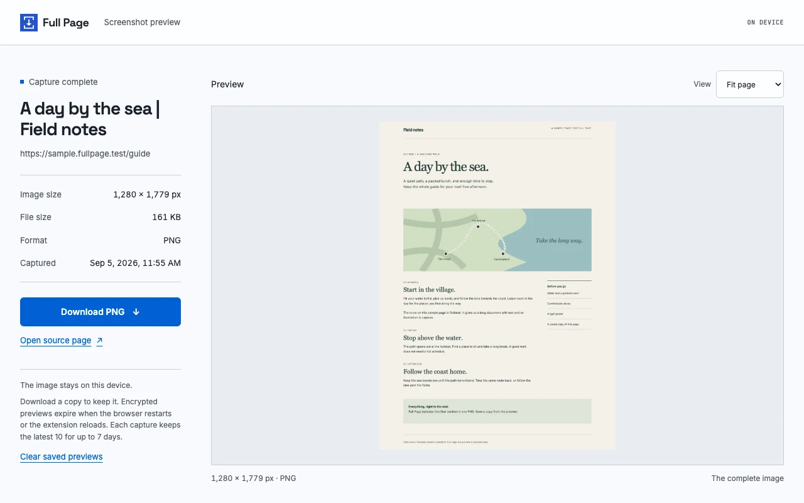

I built [Full Page](https://github.com/jewei/browser-screenshot), a Brave extension that saves a complete web page as one PNG. It works with the tab you already have open. If you're signed in, it captures that view, with your current zoom and theme.

Click "Capture full page" and the result opens in a preview tab. You can fit the whole image on screen, fill the preview's width, or inspect small text at actual size. The downloaded PNG keeps its original resolution in every mode.

This is the project's sample page, captured down to its last section.

## Getting the whole page

Images farther down a page often wait for you to scroll before they load. Full Page's "Load page images" option does that scrolling before capture. It is on by default. The [page preparation code](https://github.com/jewei/browser-screenshot/blob/main/lib/page.js) also gives images and fonts time to load, and pauses CSS animations.

The awkward part is Brave's debugging banner. Full Page uses the browser's [debugger API](https://developer.chrome.com/docs/extensions/reference/api/debugger) to measure the document and request a PNG through [Page.captureScreenshot](https://chromedevtools.github.io/devtools-protocol/tot/Page/#method-captureScreenshot). Setting `captureBeyondViewport` lets that image extend past the visible screen. Brave shows the banner while this connection is open.

When capture ends, Full Page restores your scroll position and the page settings it changed, then disconnects. Canceling the banner stops the capture. The [capture code](https://github.com/jewei/browser-screenshot/blob/main/lib/capture.js) shows the sequence.

Separate scrolling panels only show their current content. Expand collapsed sections and "Show more" content before you start. For a feed that keeps adding content, turn off "Load page images" to capture what is already there.

Full Page supports HTTP and HTTPS pages. It cannot capture browser settings, local files, or protected pages. The [image limits](https://github.com/jewei/browser-screenshot/blob/main/lib/shared.js) are 32,767 pixels on either side and 64 million pixels in total. Reduce browser zoom if the page is too large.

## Keeping captures on your device

A screenshot of a signed-in page can contain private information. Full Page asks you to read and accept a data use notice before first use. It has no upload service or analytics. The source website can still make its usual requests while images load.

Previews are temporary. The [storage code](https://github.com/jewei/browser-screenshot/blob/main/lib/storage.js) encrypts each preview before saving it in IndexedDB and keeps the key in browser session memory. Restarting Brave removes the key, so saved previews become unreadable. Reloading, updating, or disabling the extension does the same.

Download the images you want to keep. Each PNG is a separate, unencrypted file. "Clear saved previews" deletes the stored previews and their key, but leaves your downloads alone. The [privacy policy](https://github.com/jewei/browser-screenshot/blob/main/PRIVACY.md) explains the cleanup and retention rules.

## Try Full Page

[Install Full Page from the Chrome Web Store](https://chromewebstore.google.com/detail/full-page/bbnofdipbhbplddjoecmfpmcijnnpgmn). Pin it from the extensions menu.

Open a web page, wait for it to load, then open Full Page. Accept the data use notice and click "Capture full page". Check the preview, then click "Download PNG" to keep a copy.

The [README](https://github.com/jewei/browser-screenshot#readme) covers installation from source, keyboard shortcuts, and a separate Brave demo for development.
