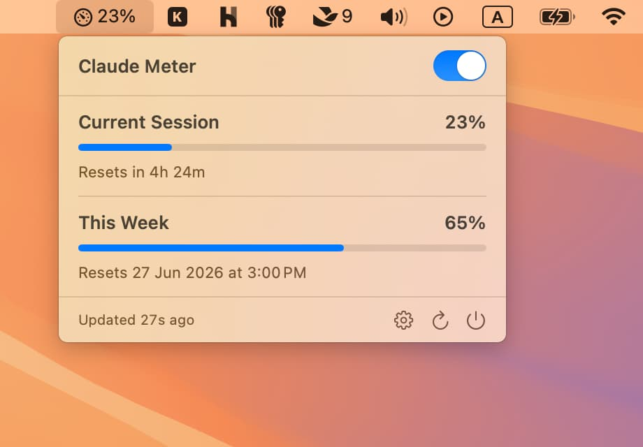
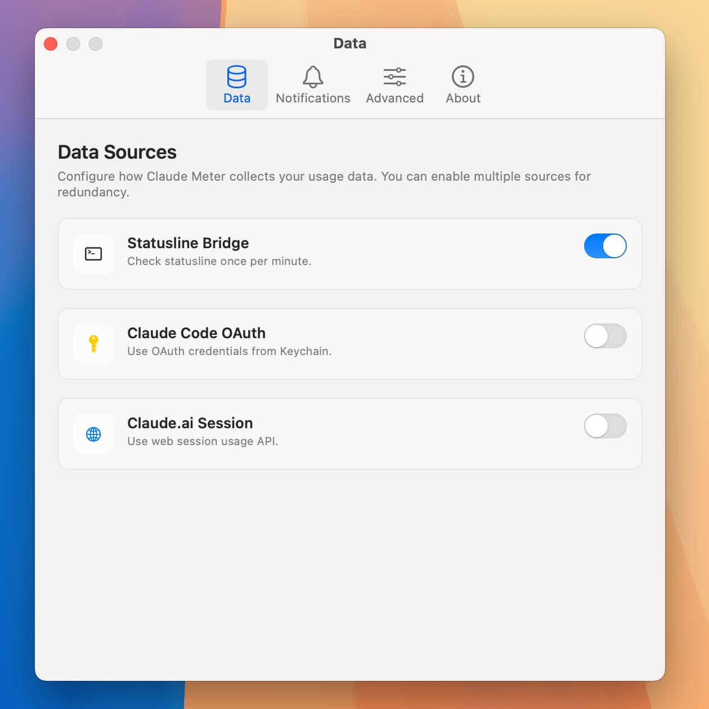
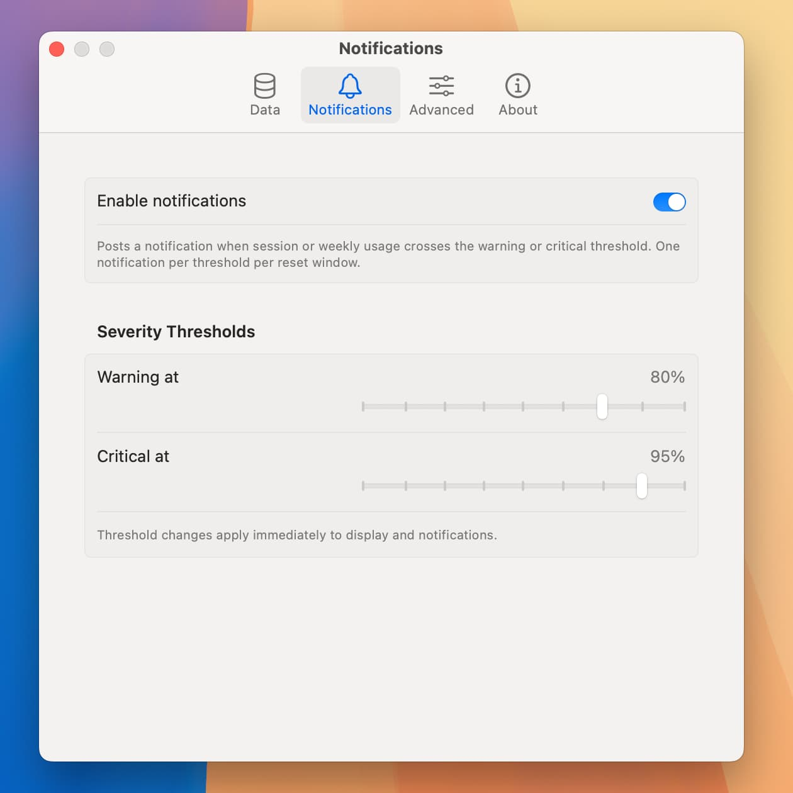
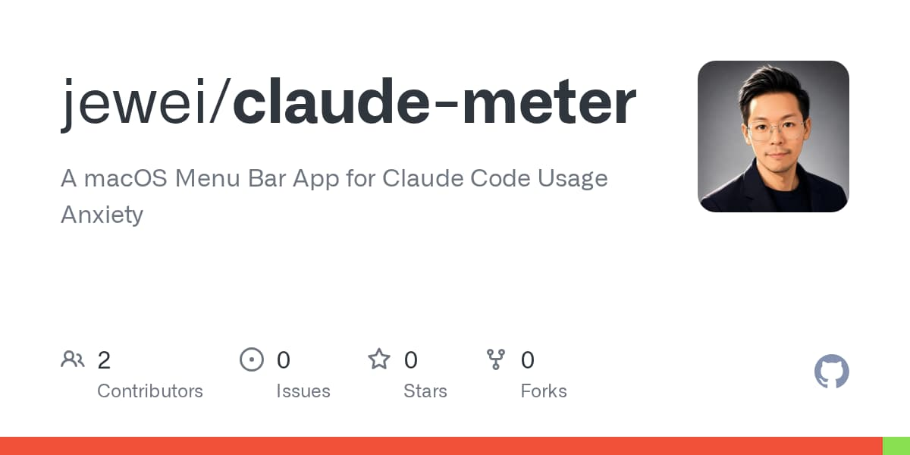

> Update: [Version 2.0 is here](https://jewei.net/claude-meter-v2) — a complete redesign that’s still free and open source for macOS, featuring a refreshed menu bar experience. [Download Claude Meter 2.0 📦](https://github.com/jewei/claude-meter/releases/download/v2.0/ClaudeMeter-2.0.dmg)

If you live in Claude Code, you know the feeling: you are deep in flow, shipping changes, and then — _rate limit_. The five-hour window you forgot you were burning through. The weekly cap you did not realize you were approaching. You context-switch to check your usage, lose your thread, and the momentum is gone.

**Claude Meter** puts that information where it belongs: quietly in your menu bar, always one glance away.

> Download the latest `.dmg` installer from releases. <a href="https://github.com/jewei/claude-meter" target="_blank" rel="noopener noreferrer" class="text-white/90! no-underline! not-italic! font-bold shrink-0 inline-flex items-center gap-2 px-5 py-2.5 bg-linear-to-r from-primary to-surface-tint font-label-md text-label-md rounded-xl shadow hover:-translate-y-0.5 hover:shadow-md transition-all duration-200" data-astro-cid-2q5oecfc=""> <svg class="w-4 h-4 shrink-0" fill="currentColor" viewBox="0 0 24 24" aria-hidden="true" data-astro-cid-2q5oecfc=""> <path d="M12 0c-6.626 0-12 5.373-12 12 0 5.302 3.438 9.8 8.207 11.387.599.111.793-.261.793-.577v-2.234c-3.338.726-4.033-1.416-4.033-1.416-.546-1.387-1.333-1.756-1.333-1.756-1.089-.745.083-.729.083-.729 1.205.084 1.839 1.237 1.839 1.237 1.07 1.834 2.807 1.304 3.492.997.107-.775.418-1.305.762-1.604-2.665-.305-5.467-1.334-5.467-5.931 0-1.311.469-2.381 1.236-3.221-.124-.303-.535-1.524.117-3.176 0 0 1.008-.322 3.301 1.23.957-.266 1.983-.399 3.003-.404 1.02.005 2.047.138 3.006.404 2.291-1.552 3.297-1.23 3.297-1.23.653 1.653.242 2.874.118 3.176.77.84 1.235 1.911 1.235 3.221 0 4.609-2.807 5.624-5.479 5.921.43.372.823 1.102.823 2.222v3.293c0 .319.192.694.801.576 4.765-1.589 8.199-6.086 8.199-11.386 0-6.627-5.373-12-12-12z" data-astro-cid-2q5oecfc=""></path> </svg>
> jewei/claude-meter</a>

## What it does

Claude Meter is a tiny macOS menu bar app that shows your Claude usage in real time:

- **Current Session** — how much of your rolling five-hour window you have used, and when it resets.
- **This Week** — your weekly usage across all models, with the reset date.

Color-coded progress bars move from calm to amber to red as you approach your limits, so you can see trouble coming before it interrupts you. Optional notifications give you a heads-up when you cross your warning or critical threshold — no surprises mid-task.

## It just works with Claude Code

Here is the part we are most proud of: **no API keys, no tokens, no setup.**

Claude Code already knows your usage. It receives that information on every request and renders it in the statusline. Claude Meter taps into the same stream. On first launch, it installs a tiny, transparent bridge into your Claude Code statusline configuration that captures the usage payload and hands it to the meter.

Your existing statusline keeps working exactly as before. The bridge simply rides along.

The result: open the app, and your real numbers are already there.

For users who want them, Claude Meter also supports optional fallback data sources: the Anthropic OAuth usage API, using the credentials Claude Code already stores, and the claude.ai usage API. But for most people, the zero-config statusline path is all they will ever need.

## Built for the way you actually work

Most of us do not run one Claude Code window. We run _several_ — a session per project, scattered across the day. Claude Meter is built for that reality.

Every open session reports its own snapshot, and each one caches usage from the last time _it_ talked to the API. That means they can all be at slightly different points in time. Claude Meter reads them all and merges them intelligently, picking the freshest reading for each window so the number you see is actually current — not just whichever session happened to update last.

It is also honest about idle time. Claude’s limits are _rolling_ windows, so when a five-hour window expires, your usage genuinely resets to zero. Leave your machine overnight and come back, and Claude Meter shows **0%** — full capacity, ready to go — instead of clinging to last night’s stale number.

## More than the menu bar

- **Widget** — drop a Claude Meter widget on your desktop or in Notification Center for an always-on view.
- **Thresholds you control** — set your own warning and critical percentages.
- **Notifications** — optional, threshold-based, and never noisy.
- **Launch at login** — set it once and forget it.
- **Auto-updates** — built in, so you always have the latest version.

## Private by design

Your usage data is yours. Claude Meter is local-first: it reads what is already on your Mac and keeps it there. Session keys and tokens are stored in the macOS Keychain and **never logged**.

The built-in diagnostics tool sanitizes everything — email addresses, home directory paths, session identifiers — before anything is copied or shown, so you can share a bug report without sharing your life.

## Free and open source

Claude Meter is free, and the source is on GitHub. Browse it, file an issue, or send a pull request:

## Get it

Download Claude Meter 1.0, drop it in your Applications folder, and launch it. If you use Claude Code, you are already set up — your numbers will be waiting in the menu bar.

Stop guessing where you stand. Start seeing it.

---

_Claude Meter is an independent community project and is not affiliated with or endorsed by Anthropic._
