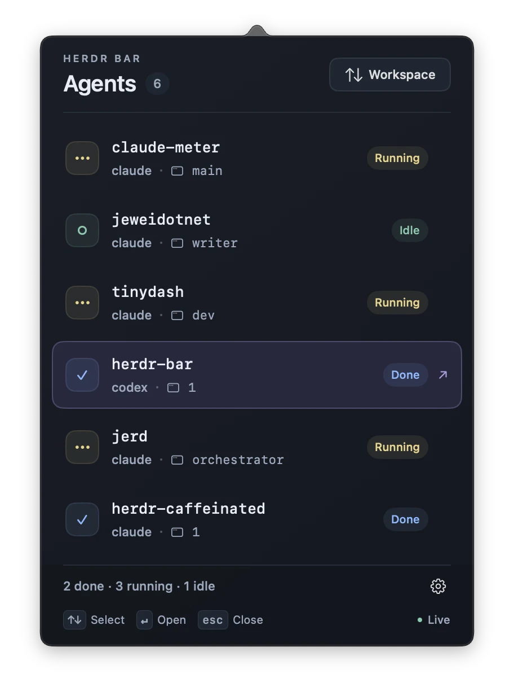

When several coding agents are working in different terminal panes, checking each one becomes another task. Herdr Bar puts their status in the macOS menu bar. Open the panel, choose an agent, and return to its pane.

It is a native companion app for [Herdr](https://herdr.dev). You need a local Herdr session and macOS 14 or later.



## See what needs attention

Version 1.0.5 shows three separate groups in the menu bar: orange for agents that need input, yellow for running agents, and blue for completed agents. Each group has its own symbol and count. Groups with no agents disappear.

Click the status item to open the panel. Each row shows the project, the agent, its pane, and its current state. Choose a row to open that agent's pane in the terminal.

With automatic terminal selection, Herdr Bar activates the terminal app that hosts the session. It does not guarantee selection of a particular outer terminal window or tab.

## Done means unread

Herdr Bar keeps its own record of completions. Another Herdr client cannot clear that record. A successful open clears the completion, and **Mark completed agents as read** clears the unread completions together.

Opening an agent that needs input leaves that state in place. You still need to answer it. Restarting Herdr Bar or changing its connection clears the local unread state.

## Live events, with a polling fallback

The app subscribes to Herdr events and can show running activity as events arrive. It checks a snapshot before showing attention states or sending notifications. If the event stream is unavailable, it requests a snapshot every two seconds.

The panel shows **Live** or **Polling**. The label's help text includes the last successful refresh and any event stream error. Settings has controls for notifications, launch at login, the terminal, and the connection.

Apps opened from Finder or at login normally do not receive shell environment variables. If the app cannot find your session, set the socket path in **Settings > Connection**. The repository has a [connection troubleshooting guide](https://github.com/jewei/herdr-bar/blob/main/docs/troubleshooting.md).

## Install Herdr Bar

The [1.0.5 release](https://github.com/jewei/herdr-bar/releases/tag/v1.0.5) includes an Apple silicon build, signed with a Developer ID and notarized by Apple. Download the ZIP, extract it, move **Herdr Bar.app** to Applications, and open it. Quit an older copy before replacing it.

The source uses SwiftUI and AppKit with no external packages. To build for your Mac, install Swift 6 tools and run:

```sh
git clone https://github.com/jewei/herdr-bar
cd herdr-bar
./scripts/build.sh --open
```

The script creates `dist/Herdr Bar.app` for the host CPU architecture. The source and build instructions are on [GitHub](https://github.com/jewei/herdr-bar).
