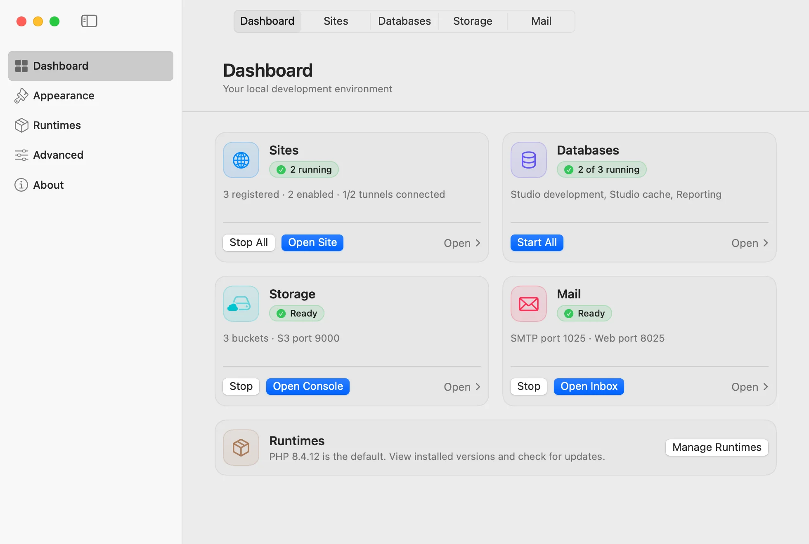
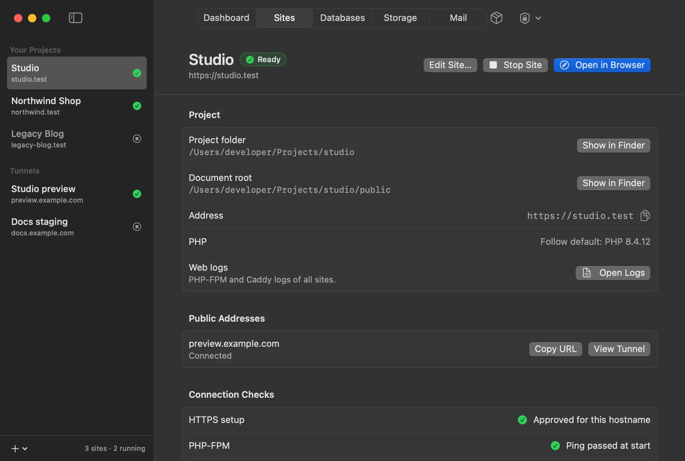
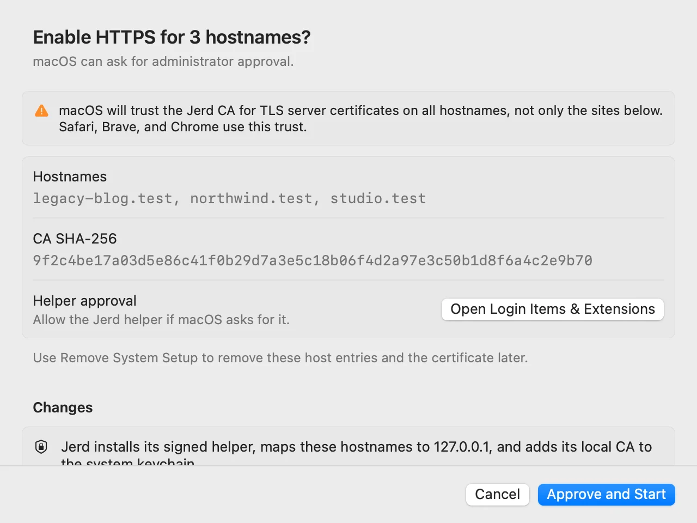
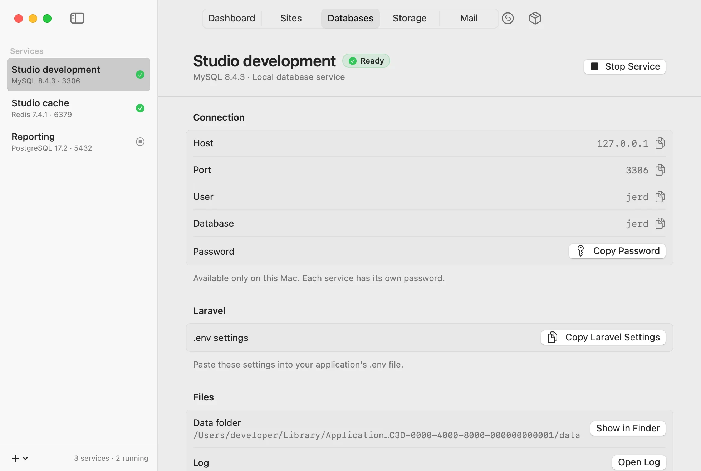
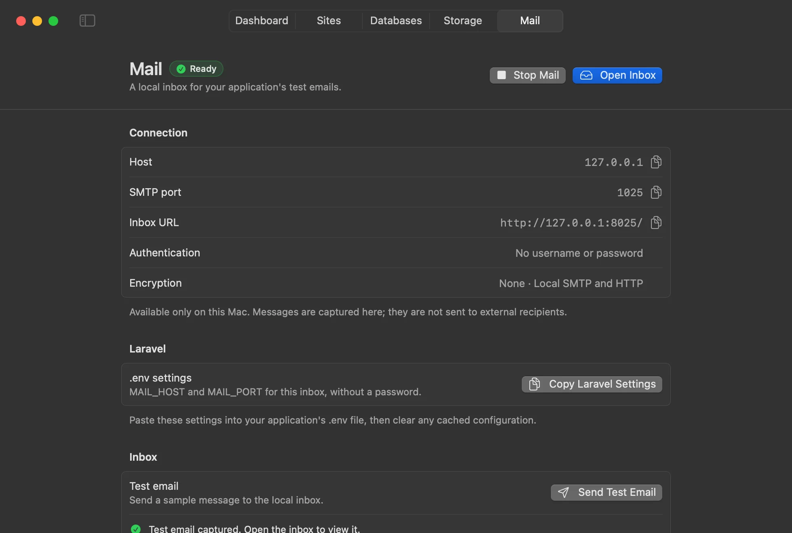

Jerd is a native macOS app for local PHP development. It serves my projects at `https://<name>.test`, runs the databases and services they need, and stays out of the way while I work.

Version 0.1.2 is out today. [Download Jerd](https://github.com/jewei/jerd/releases/latest). It is an 83 MB disk image for Macs with Apple silicon and macOS 14 or later.



## Sites over HTTPS

Add a project folder, and Jerd gives it a `.test` address, a document root, and a PHP version. Each site follows the default PHP or uses its own. Caddy and PHP-FPM serve every site over HTTPS with a local certificate authority, so Safari, Chrome, and Brave open it without a certificate warning.

Projects stay where they are. Jerd never runs project code to detect a project, and removing a site never deletes its folder.



## One approval, then out of the way

HTTPS on `.test` needs three changes on the Mac: a section in `/etc/hosts`, a trusted local CA, and the ports 80 and 443. Jerd makes them through a small signed helper, and only after you approve them. The approval sheet lists the hostnames, the CA fingerprint, and exactly what macOS will trust.

PHP, Caddy, and the databases run as your user. The helper opens the two ports, writes its own hosts section, and adds the CA trust. Nothing else runs as root. **Remove System Setup** takes all of it back, and your sites and project files stay.



## The right PHP in the terminal

Jerd adds `php`, `composer`, and `laravel` commands. Each one looks at the current folder, finds the registered project that contains it, and runs that project's PHP. Outside a project, it uses the default.

```sh
cd ~/Projects/studio
php -v            # the PHP version of the studio site
composer install
laravel new demo
```

## Databases, mail, and storage

Every service listens on `127.0.0.1` only and keeps its data after Stop and Quit.

- **MySQL, PostgreSQL, and Redis.** Run as many independent services as you need. Each database page has the host, port, and user, and a button that copies the Laravel `.env` settings.
- **Mail.** Point your app's SMTP settings at the Mailpit inbox, and every email stays on your Mac.
- **Storage.** RustFS gives you S3 buckets with the S3 API. New buckets are private.
- **Cloudflare Tunnels.** Connect a tunnel that you already have, to show a local site to someone else. Tunnel tokens stay in the Keychain.



## A small download, runtimes on demand

The app includes PHP, Caddy, Composer, the Laravel installer, and Redis. The other runtimes download the first time you need them:

| Runtime         | Download |
| --------------- | -------- |
| MySQL 8.4.11    | 168 MB   |
| PostgreSQL 18.6 | 122.5 MB |
| Mailpit 1.31.3  | 9.8 MB   |
| RustFS 1.0.0    | 87 MB    |

Jerd installs a runtime only when its checksum matches the pinned value. For MySQL, it also checks the publisher signature.



## Updates and privacy

Jerd updates itself with Sparkle from a signed feed in its GitHub repository. Every build is signed and notarized by Apple, and Jerd installs an update only after you approve it.

There are no analytics. Jerd goes online only to check for updates, to download runtimes, and to run your tunnels.

## Get it

[Download Jerd](https://github.com/jewei/jerd/releases/latest), drag it to Applications, and open it. The source is on [GitHub](https://github.com/jewei/jerd), where you can also file an issue.
