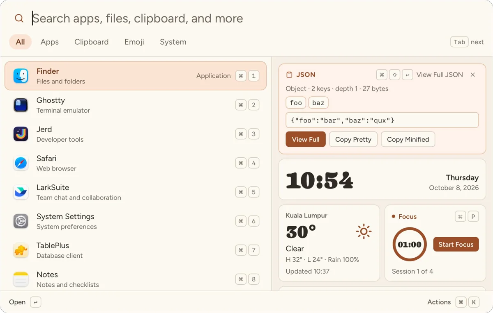
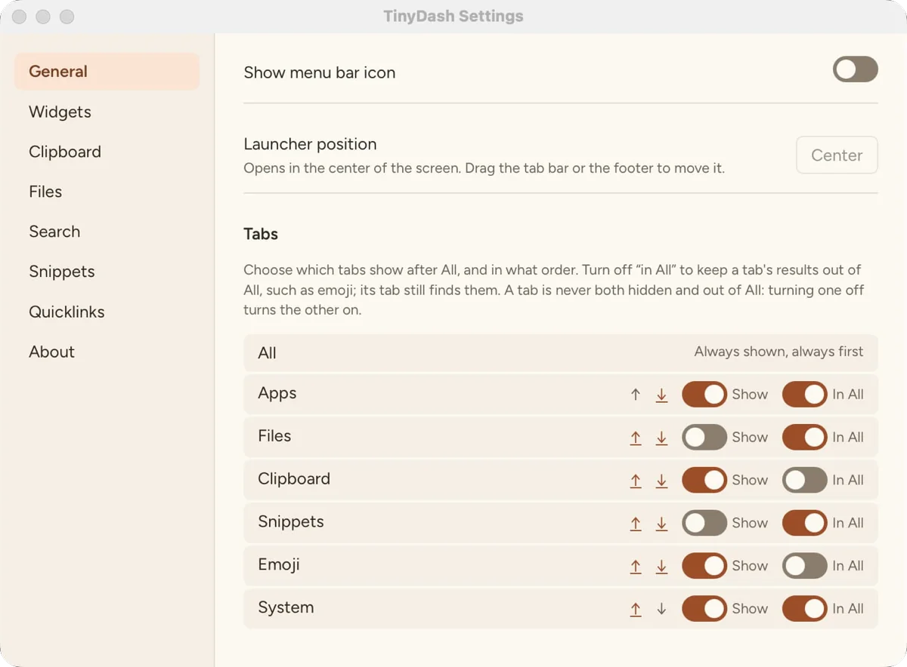

TinyDash is a keyboard-first launcher for macOS, Windows, and Linux. It is the successor to [Bopop](/bopop-press-type-go/), my macOS-only launcher.

Press Control+Shift+Space, type a few letters, press Enter. An app opens, a file opens, or an answer lands on your clipboard, and the window gets out of the way.

Version 0.5.0 is out today, free and open source under the MIT license. [Download TinyDash](https://github.com/jewei/tinydash/releases/latest).



## What it does

The launcher finds what you type:

- Apps, ranked by how often you open them. Each one says what it is for: Finder is "Files and folders", Ghostty is "Terminal emulator".
- Files and folders in the folders you choose.
- Clipboard history, with text, images, and copied files.
- Snippets and quicklinks. A quicklink such as `jira ABC-12` opens that ticket.
- Emoji, with keywords in English, Chinese, Malay, and Spanish.
- System commands: lock, sleep, restart, empty Trash.

It also answers small questions as you type:

- `12 * 8`, `5 ft to cm`, `8 Mbps to MBps`
- `100 usd to eur`, from the daily ECB rates
- `10am pacific to kl`, `next friday + 2 weeks`
- `password`, `passphrase 8`, `pin 4`
- `#2F6F5E` shows the color with its RGB, HSL, and contrast on white
- `1791354301` shows that Unix time in local time and UTC
- `chmod 755` gives `rwxr-xr-x`, and `rwxr-xr-x` gives `755`
- Paste a link full of tracking parameters, and get the clean one back

## The dashboard part

The name means "tiny dashboard". When the search is empty, the right side shows widgets instead of details. You choose which ones in Settings > Widgets:

- Clocks for your city and up to three more
- Free space on your disk, with a warning below 10%
- One scratch note (Mod+J)
- A Pomodoro focus timer with a notification at the end of each session and break (Mod+P)
- The weather for one city
- A card for what you copied, when it is a color, a Unix time, or JSON

Type one letter, and the widgets give way to your results.

## New in 0.5.0

- **Spotlight file search on macOS.** Turn on "Also search with Spotlight" in Settings > Files, and the Files tab also finds names anywhere in your home folder. Your own folders answer first; Spotlight results follow.
- **Hide a result.** "Hide from Results" removes a helper app or an old file from search for good. Settings > Search shows it again.
- **Right-click** a result to see its actions, the same menu as Mod+K.
- **A "Copied" message** confirms each copy after the launcher hides. It never takes focus from the app you return to.
- **Currency rates are off** until you turn them on. A currency query asks first.



## Local, with the network spelled out

TinyDash sends nothing about what you type, copy, or open. It has no account and no telemetry. It downloads only:

- The daily ECB rate table, if you turn currency rates on.
- The weather for your city from Open-Meteo, if you turn the weather widget on. Open-Meteo gets the city name and its location.
- A check for new versions on GitHub, on macOS and Windows, which you can turn off.

Clipboard history is off until you turn it on. It skips copies that password managers mark as secret, and it stays on your computer, unencrypted.

## Get TinyDash

Download the build for your system from the [releases page](https://github.com/jewei/tinydash/releases/latest):

- **macOS 12 or later**, Apple silicon or Intel. Signed and notarized.
- **Windows**, x64. Not code-signed, so SmartScreen may ask you to confirm.
- **Linux**, a Debian package. The global shortcut needs X11; on Wayland, bind a desktop shortcut to `tinydash`.

On macOS and Windows, TinyDash updates itself when you choose Install and Restart.

It is built with Rust, Tauri, and SolidJS. To build it yourself:

```sh
git clone https://github.com/jewei/tinydash
cd tinydash
bun install
bun run build
```

The macOS build gets the most desktop time. The Windows and Linux builds pass the same tests in CI but see far less real use, so reports from those systems help most. If something feels off, [open an issue](https://github.com/jewei/tinydash/issues).
