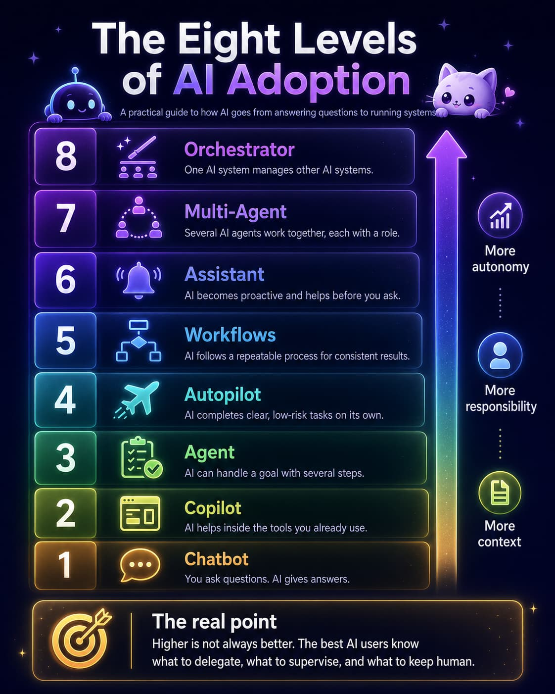

Most people say they "use AI" when they mean they ask ChatGPT questions.

That is like saying you "use the internet" because you know how to open Google.

AI adoption has levels. Each level gives AI a little more context, responsibility, and permission to act. The point is not to rush to the highest level. The point is to know which level fits the work.

## 1. Chatbot

This is where most people start.

You ask a question, paste in information, and get a response. It can help you draft, summarize, explain, brainstorm, and rewrite.

But the work is still manual. You provide the context. You judge the answer. You move the output into your actual work.

## 2. Copilot

A copilot sits inside the tools you already use.

Think documents, spreadsheets, inboxes, code editors, or design tools. Instead of jumping between tabs, AI helps while you are already working.

It edits, suggests, completes, and improves. You are still driving. It just makes the work smoother.

## 3. Agent

An agent can handle a goal, not just a prompt.

You might ask it to research a topic, create an outline, draft the piece, improve the headline, and check the logic. It can move through several steps on its own.

This is where AI starts to feel less like a tool and more like a junior colleague: useful, fast, but still not someone you leave unsupervised.

## 4. Autopilot

Autopilot is when you give AI a task and let it run.

This works when the job is clear and low-risk: cleaning data, drafting internal notes, generating test cases, or creating a first version of a report.

It saves time, but you still need to inspect the result. The danger is not that AI fails loudly. The danger is that it sounds right when it is wrong.

## 5. Workflows

This is where AI becomes serious.

Instead of using it randomly, you build repeatable processes. For example: analyze the customer, identify the pain point, draft the message, check the brand voice, then produce the final copy.

A workflow turns AI from a clever assistant into a reliable system.

## 6. Assistant

At this level, AI starts to anticipate.

It can brief you before meetings, flag important emails, summarize feedback, or track project risks before you ask.

The trick is restraint. A good assistant does not create more notifications. It reduces mental load.

## 7. Multi-Agent

Now several AI agents work together.

One researches. One writes. One reviews. One codes. One tests. Each has a role.

This can be powerful for complex work, but only with clear structure. Otherwise, you do not get intelligence. You get noise at scale.

## 8. Orchestrator

The final level is an AI system that manages other AI systems.

You set the goal, standards, constraints, and approval points. The orchestrator assigns the work, tracks progress, and combines the result.

This sounds futuristic, but the principle is familiar: good delegation.

## The Real Point

The eight levels are not a competition.

Higher is not automatically better. Some work needs close human judgment. Some work can be automated. Some work needs a workflow. Some work needs agents.

The best AI users are not the ones who use the most complicated tools.

They are the ones who know what to delegate, what to supervise, and what to keep human.

That is the real advantage.
