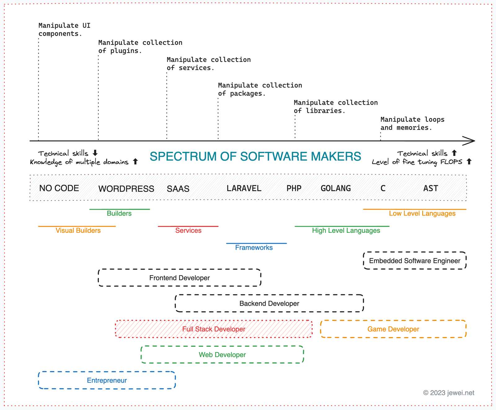

The realm of software development is vast, and the skills within it stretch far beyond just writing code. Whether you're crafting marketing forms through drag-and-drop builders or optimizing performance-critical systems, each type of software maker plays a unique role in this ecosystem.

A useful way to conceptualize this vast domain is through the ***Spectrum of Software Makers***, a continuum that ranges from **no-code platforms** to deep technical work such as manipulating **Abstract Syntax Trees (ASTs)**.

In this post, we’ll explore this spectrum, helping you identify where you stand and how to leverage your skills to build a career, business, or personal projects that align with both your passions and goals.

**The Spectrum of Software Makers**  
_(Insert updated diagram here: the spectrum ranges from no-code platforms to systems-level programming, with programming languages and frameworks in between. Based on your background as a PHP/Laravel developer, adjust to reflect various modern development paradigms.)_

---

As a software maker with entrepreneurial ambitions, your chosen tools and approach—whether it’s leaning on no-code platforms, building a Laravel-based product, or diving deep into a performance-critical language like **Rust**—will have dramatic implications for **your business’s scalability and development timeline**.

Let’s dive into the **Spectrum of Software Makers** and explore the various pathways you can take.

---

### No-Code Development: Simplicity at Scale

**No-code platforms** provide simple, intuitive drag-and-drop interfaces with logic-based configuration, making it straightforward for anyone looking to get a product to market. Most platforms provide pre-built components like forms, workflows, and databases that anyone with little to no coding experience can manipulate.

- **Pros**:
  - Quick entry to the market—ideal for MVPs or prototypes.
  - Ideal for people/businesses who want to focus on **business logic** without hiring full development teams.
- **Cons**:
  - **Limited customization** after a certain point. As your business scales or requirements become complex, no-code platforms might hit performance, feature, or customization roadblocks.
  - Ongoing **subscription fees** may accumulate and reduce profitability as usage scales.

> Popular No-Code Tools: **Bubble**, **Webflow**, **Airtable**, **OutSystems**

This can be a great choice for entrepreneurs looking to validate an idea quickly or for those venturing into business with minimal technical skills.

---

### WordPress CMS: The King of Content Management

With **WordPress**, which powers over 40% of the web, the platform is an excellent starting point for building content-rich websites or smaller e-commerce stores. With plugins, themes, and an active community, customization is relatively easy.

- **Pros**:
  - Huge ecosystem of **plugins**, themes, and **integrations**.
  - Low barrier to entry—ideal for non-technical users looking to manage content.
- **Cons**:
  - Poor fit for applications needing **complex business logic** or heavy load.
  - Plugins can slow down performance or introduce **security vulnerabilities** if not maintained.

WordPress works well for blogs, small e-commerce, and websites that are primarily **content-driven**. However, making it work for **complex applications** is a gamble, as the system can become cumbersome.

> Popular WordPress Plugins: **WooCommerce**, **Elementor**, **Yoast SEO**

---

### SaaS Tools: Automation & Integration Without Code

SaaS platforms like **Zapier**, **Notion**, and **Airtable** let non-technical users automate workflows and integrate different services without writing code. They are especially useful for small teams or individuals looking to optimize productivity.

- **Pros**:
  - Enables **automation** and integration across apps quickly.
  - Bypasses custom development for commonly requested features.
- **Cons**:
  - **Subscription expenses** build up: You may rely on multiple paid services, eating into your revenue.
  - Lack of **full control** or flexibility for highly specialized tasks.

SaaS tools can be valuable for **workflow automation** and lightweight application needs. However, be mindful of accumulating costs and limitations when tasks aren’t covered by existing integrations.

> Popular SaaS Tools: **Zapier**, **Integromat (Make)**, **Notion**

---

### Laravel/Next.js: Frameworks for Full-Custom Solutions

When you’re ready to dive into actual coding, frameworks like **Laravel** for PHP or **Next.js** for JavaScript offer structured environments that expedite development by providing built-in utilities like authentication, routing, and database access.

- **Pros**:
  - Frameworks abstract much of the "boilerplate code," allowing you to focus on business logic.
  - Strong **developer communities** mean strong support, libraries, and feature updates.
- **Cons**:
  - There’s some **learning curve** compared to no-code or CMS solutions.
  - Deployment and maintenance still require a decent knowledge of DevOps and server management, though this can be streamlined with services like **Forge** or **Vercel**.

If you’re building a platform or product that requires custom features and greater flexibility than no-code or CMS solutions can provide, Laravel or Next.js are suitable frameworks that can balance full-stack development with speed and productivity.

> Popular Frameworks: **Laravel (PHP)**, **Rails (Ruby)**, **Next.js (React)**, **Django (Python)**

---

### High-Level Programming Languages: Full Control at a Slower Pace

Using a high-level language like **PHP**, **JavaScript**, **Go**, or even **Python** for highly customized software development gives you immense control. Depending on the language, you might even forego a framework entirely to get more granular with your project.

- **Pros**:
  - Full control and flexibility when building complex business logic or integrating systems.
  - High-level languages are ideal for building custom SaaS products, backend services, or server-side applications.
- **Cons**:
  - Full custom code takes more time and precision, which can slow down development.
  - You’ll need a clear strategy for handling **DevOps**, **testing**, **security**, and **scaling** as your business grows.

High-level languages are the backbone for developers building **niche services** or products like **trading bots**, SaaS for specific industries, and more. You have the power to customize every aspect of the product, though this comes at the cost of time and complexity.

---

### Performance-Critical Systems: Low-Level Languages

Languages like **C**, **Rust**, or **C++** are aimed at performance-critical systems like **high-frequency trading platforms**, **embedded systems**, or anything where **speed and precision** are paramount and where every millisecond counts.

- **Pros**:
  - Extremely powerful for **optimized, performance-sensitive projects**.
  - Perfect for systems needing a high level of control over memory and CPU usage.
- **Cons**:
  - Steep learning curves and long development times, making it impractical for fast-to-market business plans.
  - Hiring skilled developers proficient in low-level languages comes at a premium.

Unless you’re looking to create **performance-critical** systems for specialized fields like **financial trading** or hardware-adjacent technologies (think **IoT platforms** or **medical devices**), most businesses will rarely choose this path.

---

### What's Your Blueprint? Choosing the Right Place on the Spectrum

Understanding the spectrum of software makers is like holding a **roadmap** for your journey as a developer or entrepreneur. Here’s how you can strategically choose your position:

- **Have a quick MVP or small project idea?** No-code or **WordPress** is likely your best approach for getting something to market at lightning speed.
- **Need custom logic for a SaaS product?** Choose **Laravel** or **Next.js** to maximize speed while retaining control.
- **Building serious, performance-centric software?** Go down to **high-level programming** or even **low-level languages** like **Rust** for critical applications.

---

### Why Understanding This Spectrum Is Key

The most important takeaway from this spectrum is understanding your **strengths and weaknesses**and using that knowledge to make **informed decisions**. Whether you're looking to **upskill**, **pivot your career**, or start a new project, where you fall on the spectrum will shape your success trajectory.

In today's world of fast-moving technology, staying aware of your position—and your tools—is **critical** to your success as a software maker.
