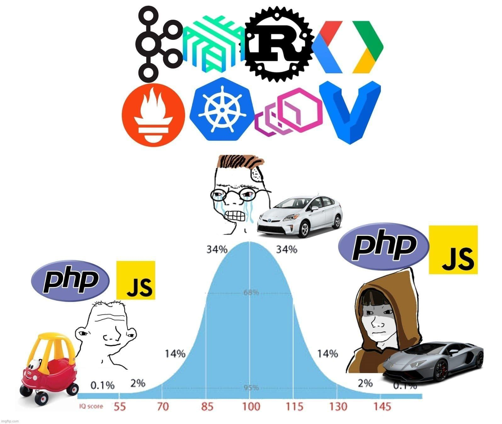

In the ever-evolving landscape of web development, one question arises time and again: **Is PHP dead?**

For over a decade, some corners of the development community have been quick to dismiss this ubiquitous server-side scripting language, declaring that it’s on its way out. The reality, however, is far more nuanced. Let’s unpack why PHP's "death" has been greatly exaggerated, and how modern PHP has evolved into a robust, performant, and competitive tool in today’s development ecosystem.

### Why Some Developers Hated (or Still Hate) PHP

Let’s acknowledge this up front: **PHP didn’t always have the best reputation**.

**1. The Spaghetti Code Era**

One of the most pervasive criticisms of PHP is the way it historically encouraged the mixing of HTML and logic. Back in the early days of web development, PHP scripts were often interwoven directly into HTML files, with no clear separation of concerns between logic and presentation. This led to what became known as **"spaghetti code"**—long, tangled files that were difficult to maintain.

This stereotype became so entrenched that even years after PHP had moved on to more modern paradigms, some developers still associate it with chaotic, hard-to-maintain codebases. PHP's past sins have cast a long shadow, even though the language has evolved dramatically in response to these early criticisms.

**2. PHP < 7.0 Was (Mostly) Bad**

It’s hard to argue against the fact that **PHP prior to version 7.0** was a bit of a mess. Versions like **PHP 4**and **PHP 5**, while functional, had their limitations—namely, poor performance, inconsistent API designs, and slow addition of modern language features.

To make matters worse, there were **tons of outdated tutorials** floating around that pushed bad practices. Many of these tutorials led new developers into dark corners of the language, perpetuating PHP criticism for far longer than deserved.

The best-known critique from this era is **Eevee's infamous blog post** ["PHP: A Fractal of Bad Design"](https://eev.ee/blog/2012/04/09/php-a-fractal-of-bad-design/). Released in 2012, it laid out a scathing critique of PHP’s disjointed evolution and inconsistencies. At that point, **it was “cool” to hate PHP**, and the platform’s reputation took a significant hit, even as it continued to power millions of websites thanks to its ease of use.

**3. WordPress: Hero or Villain?**

And yes, we can’t overlook **WordPress**. As an incredibly popular CMS and blogging platform, WordPress is built on PHP. While WordPress itself is remarkable for its flexibility and open-source nature, it’s also the catalyst for many complaints about PHP. With its reliance on plugins and themes (many of which are poorly coded), **WordPress has perpetuated a lot of bad PHP practices**. However, hating on PHP because of WordPress is like blaming a hammer for someone building a bad table—it’s *how* the tool is used, not the tool itself.

### The Modern Face of PHP: Vital, Fast, and Ever-Improving

Midwit PHP/JS

Thankfully, the **PHP of today** is not the PHP of a decade ago. With each release, PHP has moved farther from its old reputation and closer to the center stage as a powerful tool for modern SaaS businesses, scalability, and high-performance applications. Let’s explore the bold new PHP.

**1. The Turning Point: PHP 7 and Beyond**

The release of **PHP 7.0** marked the start of *PHP's renaissance*. PHP 7 was essentially a **major overhaul**of the language, and it has continued to improve with each iteration since. Here’s what made PHP 7—and its subsequent versions—a game changer:

- **Massive Performance Improvements**: PHP 7 introduced significant optimizations under the hood, with performance gains of up to **2-3 times faster** than PHP 5. In specific benchmarked use cases, PHP surpasses **Python** and **Ruby**, making it a legitimate option for high-performance web applications without the need for intensive hardware.
- **Memory Efficiency**: Not only did PHP 7 boost performance, but it also improved **memory usage**compared to PHP 5, making it perfect for developers looking to optimize resource consumption on cloud infrastructure or shared hosting environments.
- **Modern Language Features**: PHP now offers **scalars, return type declarations, anonymous classes, strict typing**, and **engine exceptions**, among many other forward-thinking features that align with modern development best practices.

> PHP is not resting on its laurels—new features are consistently rolled out with each release, keeping the language agile and competitive. Just look at **PHP 8.x**, which has introduced **JIT compilation**, **union types**, and even more features aimed at improving developer productivity.

**2. PHP Standard Recommendations (PSRs)**

PHP would not have regained its footing without the community’s immense efforts. Several standards have been formalized under the banner of **PHP-FIG** (PHP Framework Interoperability Group), leading to a collection of **PHP Standard Recommendations (PSRs)** that provide guidance for:

- **Coding standards** (PSR-1, PSR-12)
- **Autoloading** (PSR-4)
- **HTTP message interfaces** (PSR-7)

These standards bring **consistency** to various PHP frameworks, libraries, and open-source projects, creating a sense of structure and interoperability that was long missing in the language.

**3. Ecosystem and Tools, Built by the Community**

The **PHP ecosystem** has evolved significantly, thanks largely to robust community support and the maturity of developer tools and frameworks.

- **Typing & Static Analysis**: If you’re a fan of **strict typing** or want to ensure your codebase remains rock-solid, PHP now boasts excellent **static analysis tools** like [**PHPStan**](https://phpstan.org/) and [**Psalm**](https://psalm.dev/), which analyze your code and enforce type rules, reducing the chance for bugs in production.
- **Frameworks with Excellent Developer Experience**: One of PHP’s crown jewels is **Laravel**, a full-stack PHP framework known for its **developer experience (DX)**. Laravel has grown into one of the most loved frameworks across any language, offering:Laravel’s documentation is often hailed as **the best among open-source projects**, making coding in PHP a productive, delightful experience.
  - **Elegant syntax and structure** that promotes clean, maintainable codebases.
  - **Laravel Ecosystem**: From **Horizon** (queue management) to **Forge** (server deployment), Laravel offers a rich suite of tools connected seamlessly to streamline development and operations.
- **Modern SPA Tools**: Want **interactive, real-time** front-end frameworks baked into your PHP app? PHP can handle that too. With tools like [**Livewire**](https://livewire.laravel.com/), you can create dynamic, front-end-like interactions (similar to **Hotwire** or **Phoenix LiveView**) while keeping the bulk of your logic backend-driven.
- **Package Management Superior to NPM?**: If you’ve ever struggled with **NPM** dependency woes, **Composer** will feel like a breath of fresh air. **Composer** is often considered the **best package manager** across programming languages, handling dependency resolution, autoloading, and package updates with ease. No more cryptic errors or dependency hell—Composer just works.
- **Desktop Apps with PHP**: Even desktop applications have embraced PHP’s versatility. With [**NativePHP**](https://nativephp.com/), you can now write desktop apps using PHP, adding an extra layer of versatility for web developers who want to branch out.

**4. PHP in the Wild: It’s Everywhere**

If you're still convinced PHP is dead, take a closer look at how widely it's used:

- **WordPress** (still one of the most popular platforms globally) is powered by PHP.
- **Facebook** originally started as a PHP project and continues to use its own compiled version of the language through **Hack**.
- **Slack**, **Mailchimp**, and **Wikipedia** also rely on PHP under the hood.

The language powers **approximately 77.6% of all websites** whose server-side programming language is known, according to W3Techs as of 2024. That’s an overwhelming majority of the internet, which hardly sounds like "dead" to me!

### In Closing: PHP Isn’t Dead, It’s Thriving

The narrative that **PHP is dead** has persisted for far too long, often driven by dated critiques and misconceptions. In reality, modern **PHP is fast, efficient, and full of forward-thinking features that align with today's development best practices**. With active community involvement, consistent feature improvements, and massive real-world utilization, PHP remains a **thriving language** in the global web development landscape.

At the end of the day, PHP is still the **workhorse of the web**, and it's safe to say—**reports of its death have been greatly exaggerated.**

---

**Update**: [Laravel](https://blog.laravel.com/accel-invests-57m-into-laravel) raises a $57 million Series A from [Accel](https://www.accel.com/noteworthy/our-series-a-investment-in-laravel-the-future-of-shipping).
