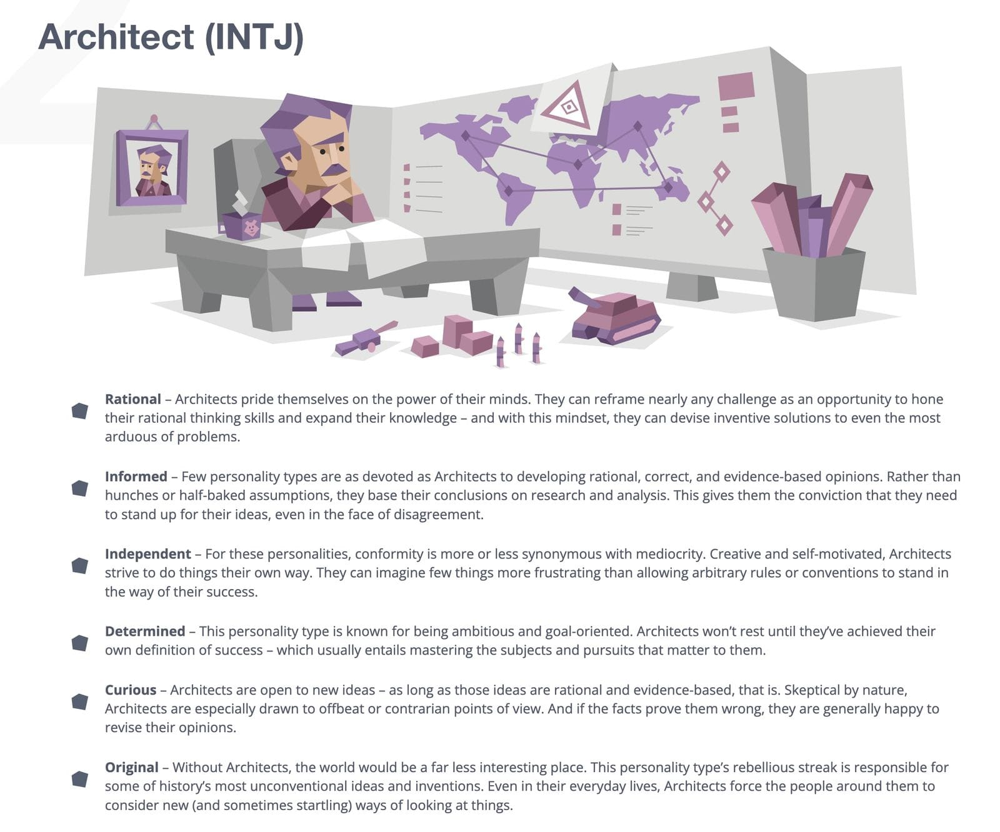
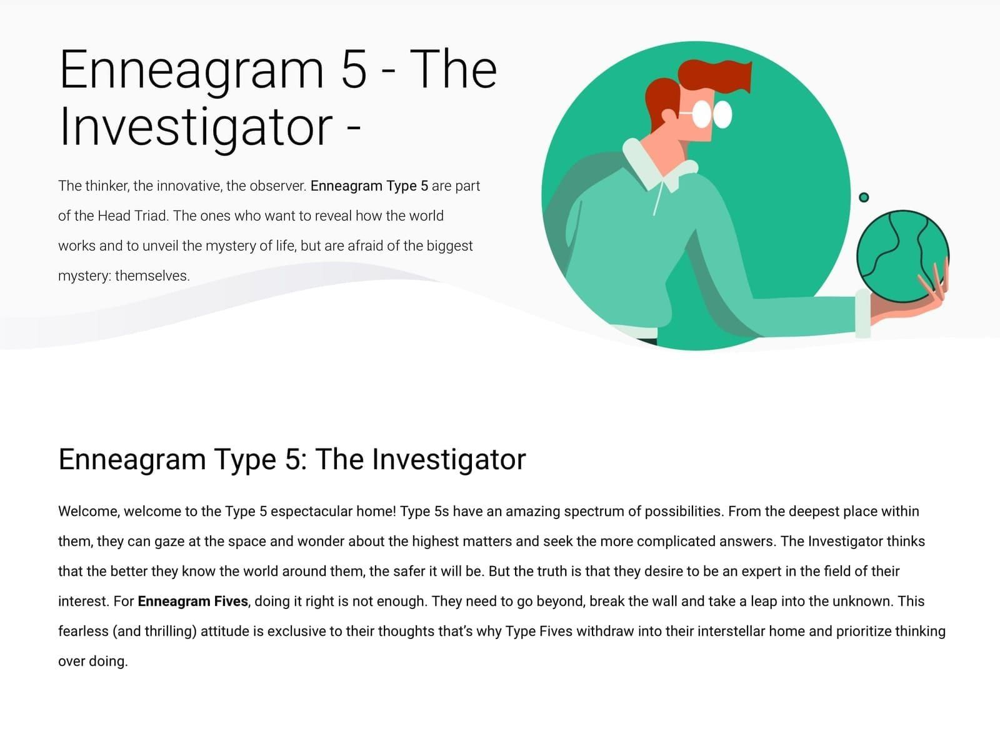

Hello. 你好。Apa khabar.  
こんにちは. Bonjour. 안녕하세요.  
Hola. नमस्ते. Γεια σας.

_Jewei in an unknown parallel universe._

---

## The Author 🚀

Hey there! 👋 My name is **Jewei**. I’m a **software engineer** who enjoys building useful things for startups and product teams.

These days, I spend less time handcrafting code the old-fashioned way and more time wrangling AI harnesses, steering the chaos, and turning ideas into product-first software. Speed is fun, but I still obsess over clean architecture, thoughtful DX, and systems designed to age well.

Most of my work lives in the practical world of backend systems, product architecture, APIs, and delivery workflows. Still, I like leaving room for craft, curiosity, and the occasional over-engineered side quest.

## The Mysterious Case of the INTJ 🧠

According to the good old **Myers-Briggs Type Indicator**, I’m an INTJ: analytical, independent, and happiest when turning tangled problems into clear systems.

_These thoughtful tacticians love perfecting the details of life, applying creativity and rationality to everything they do. Their inner world is often a private, complex one._

More specifically, the test says I’m an [assertive](https://www.16personalities.com/articles/assertive-architect-intj-a-vs-turbulent-architect-intj-t?ref=jewei.net) [architect](https://www.16personalities.com/intj-personality?ref=jewei.net).

_The thinker, the innovator, the observer. The one who wants to reveal how the world works and unveil the mystery of life, while quietly avoiding the biggest mystery: themselves._

On the Enneagram, I’m [the investigator](https://www.enneagraminstitute.com/type-5?ref=jewei.net), or [5w6](https://enneagramuniverse.com/enneagram/learn/enneagram-wings/enneagram_5w6/?ref=jewei.net): the problem solver.

## Cool Things I Love 🤔

When I’m not deep in code, hunting bugs, or shaping another product idea, I try to give the analytical side of my brain a break.

1. 📸 **Photography:** Capturing the right light, expression, or quiet detail at the right moment. Portraits, landscapes, everyday scenes; all of it helps me notice more.
2. 📚 **Books:** Psychology, systems thinking, philosophy, sci-fi, and anything that makes the world feel stranger, wider, or more understandable.
3. 🍳 **Cooking:** Cooking feels a lot like coding: precision matters, but so does instinct, timing, and knowing when to stop tinkering.
4. 🎵 **Music:** The right song can reset a mood, sharpen a thought, or turn an ordinary stretch of time into something cinematic.

---

## Let’s Connect 💬

I enjoy collaborating on complex problems, sharing ideas, and having the kind of conversations that stretch how we think. Reach out if you:

- Have an interesting software problem to discuss
- Want to **collaborate** on something useful, thoughtful, or delightfully weird
- Just want to talk about code, products, books, photography, or food

I’m just an email away at **[jewei@duck.com](mailto:jewei@duck.com)**.

## Lastly

Thanks for stopping by. I hope you enjoy poking around this site.

If you enjoy my work and want to support it, you can [sponsor me on GitHub](https://github.com/sponsors/jewei?frequency=one-time). 🙏
